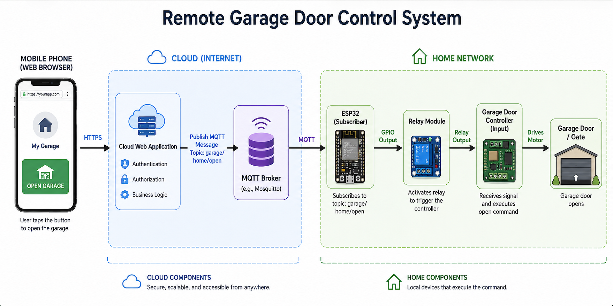

# Gate Controller

Gate Controller is a Spring Boot web application for securely opening a gate
through MQTT. An authenticated user submits their browser's current location,
the application verifies that they are within the configured distance of the
gate, and then publishes the configured command to an MQTT topic.

The application also records gate-command attempts, provides an event history,
and includes administrator pages for managing users and runtime configuration.



## Features

- Form-based authentication with `ADMIN` and `USER` roles
- Geographic distance validation before a gate command is published
- MQTT 5 command publishing with configurable broker, credentials, topic, QoS,
  and payload
- Persistent H2 storage for users, configuration, and audit events
- Administrator-only user management through a web page and REST API
- Administrator-only MQTT and gate-location configuration
- Gate event history ordered from newest to oldest
- Spring Boot Actuator health endpoint

## How a gate command works

1. The browser sends its latitude, longitude, and location accuracy.
2. The application records the command attempt in the event history.
3. The configured gate coordinates and maximum allowed distance are loaded.
4. The Haversine formula is used to calculate the distance to the gate.
5. If the user is close enough, the configured MQTT message is published.
6. The page reports whether the command succeeded or why it was rejected.

Location validation is performed by the server, but browser-provided coordinates
should not be treated as tamper-proof. Deployments requiring stronger physical
access guarantees should add a trusted location or device-verification
mechanism.

## Technology

- Java 25
- Spring Boot 4
- Spring MVC and Thymeleaf
- Spring Security
- Spring Data JPA
- H2 database
- Eclipse Paho MQTT 5 client
- Maven
- JUnit 5, AssertJ, and Mockito

## Application routes

| Method | Route | Access | Description |
| --- | --- | --- | --- |
| `GET` | `/` | Public | Login page |
| `POST` | `/login` | Public | Spring Security login processing |
| `GET` | `/button` | `ADMIN`, `USER` | Gate-control page |
| `POST` | `/button` | `ADMIN`, `USER` | Validate location and publish a command |
| `GET` | `/events` | `ADMIN`, `USER` | Audit-event history |
| `GET` | `/config` | `ADMIN` | Configuration page |
| `POST` | `/config` | `ADMIN` | Save configuration |
| `POST` | `/config/delete` | `ADMIN` | Delete configuration |
| `GET` | `/users` | `ADMIN` | User-management page |
| `GET` | `/actuator/health` | Authenticated | Application health |

### User REST API

All user API operations require the `ADMIN` role.

| Method | Route | Description |
| --- | --- | --- |
| `GET` | `/api/users` | List users |
| `GET` | `/api/users/{id}` | Retrieve a user |
| `POST` | `/api/users` | Create a user |
| `PUT` | `/api/users/{id}` | Update a user |
| `DELETE` | `/api/users/{id}` | Delete a user |

Passwords supplied through create or update operations are BCrypt encoded before
they are stored.

## Configuration

The default configuration is in
[`src/main/resources/application.yaml`](src/main/resources/application.yaml).
Provide the MQTT credentials through environment variables:

```shell
export mqtt_broker='tcp://localhost:1883'
export mqtt_user='gate-controller'
export mqtt_pass='change-me'
```

The following database environment variables are optional:

```shell
export DB_USER='sa'
export DB_PASSWORD=''
```

Important defaults:

- HTTP port: `8081`
- SSL: disabled
- Database: file-backed H2 at `/opt/gatecontroller/data/mydb`
- MQTT topic: `garage/gate/command`
- MQTT payload: `OPEN`
- Maximum gate distance: `20` meters

Update the datasource path in `application.yaml` when `/opt/gatecontroller/data`
is not writable in the local environment.

On the first startup, the application initializes:

- A default administrator with username `admin` and password `admin`
- One configuration record populated from `application.yaml`

Change the default administrator password and MQTT credentials before exposing
the application outside a development environment.

## Build and run

Requirements:

- JDK 25
- Maven 3.6 or later
- An accessible MQTT 5 broker

Run the tests:

```shell
mvn test
```

Start the application:

```shell
mvn spring-boot:run
```

Then open:

```text
http://localhost:8081/
```

Build an executable JAR:

```shell
mvn clean package
java -jar target/GateController-0.1.0.jar
```

## Project structure

```text
src/main/java/com/cvezga/gatecontroller/
├── config/       Security, bootstrap data, and shared MVC attributes
├── controller/   Web pages and REST endpoints
├── dto/          API response types
├── entity/       JPA entities
├── exception/    Domain exceptions and REST error handling
├── model/        MVC form models
├── repository/   Spring Data repositories
└── service/      User, configuration, event, and MQTT business logic
```

## Tests

The unit test suite covers controller responses, service behavior, security
initialization, configuration invariants, exception handling, MQTT failure
paths, and domain-object contracts.
